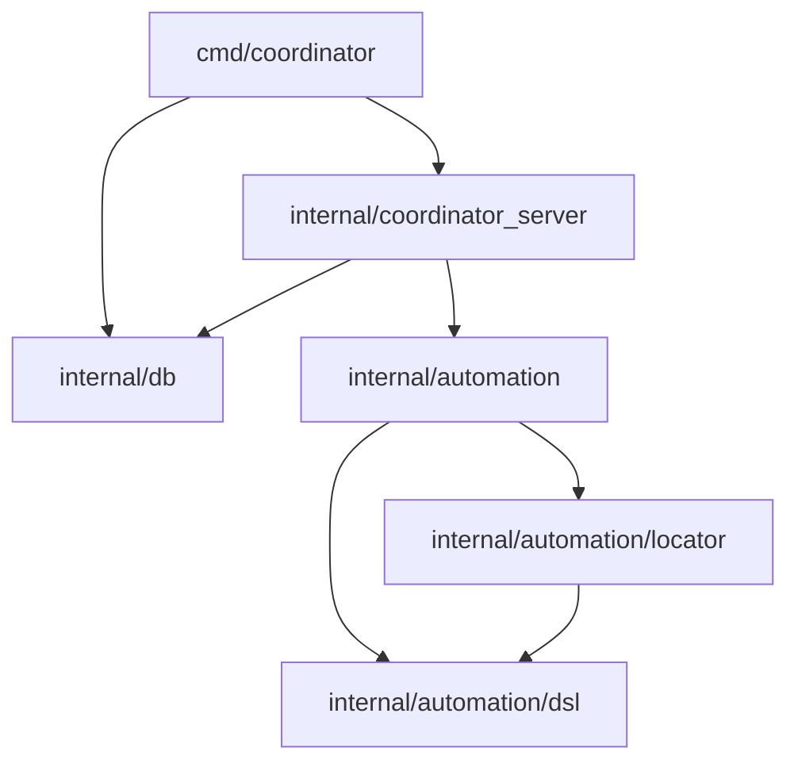

# 14 — Refactoring Architecture & Package Modularization

This document details the refactoring and modularization changes performed on the Protean Provider codebase. These updates reduce technical debt, eliminate monolithic file dependencies, and establish a clear domain-driven structure.

---

## 1. Modular Decomposition Goals
As the codebase grew, several core domains suffered from monolithic file dependency and circular imports. The refactoring addresses these by:
- Grouping logically similar structures and logic into domain-specific subpackages.
- Maintaining backward compatibility for external callers using Go **type aliases** and **function/variable forwards** (facade pattern).
- Decoupling infrastructure code (like the PostgreSQL database helper) from server controllers.

---

## 2. Key Abstractions & Subpackages

### A. Automation & DSL (`internal/automation/`)
The native automation execution engine has been split into two new sub-packages:

#### 1. `internal/automation/dsl/`
- Contains core YAML/JSON models for the automation domain (`Script`, `Step`, `Rect`, `UIElement`, etc.).
- Houses parsing routines (`ParseScript`, `ParseScriptFile`) and serialization (`ToYAML`).
- Declares the `FlattenTree()` method on `UIElement`.

#### 2. `internal/automation/locator/`
- Holds elements-matching and touch coordinates target resolving logic.
- Modularized files:
  - `locator.go`: Match scoring comparing target `UIElement` to candidate elements.
  - `locator_tree.go`: Parsers converting raw XML dumps to virtual layout hierarchies.
  - `locator_scoring.go`: Layout/container click likelihood classifiers.
  - `locator_generation.go`: Context anchors extraction and query generators.
  - `locator_legacy.go`: Backward-compatible element lookup algorithms.
  - `locator_xpath.go`: Simple and indexed XPath parsing engine.

#### 3. Facade Layer (`internal/automation/dsl.go` & `locator.go`)
To prevent breaking existing code that imports `protean-provider/internal/automation`:
- `dsl.go` utilizes Go type aliases (e.g. `type UIElement = dsl.UIElement`) to redirect all DSL references.
- `locator.go` maps public functions/variables to the `locator` subpackage (e.g. `var ParseXMLTree = locator.ParseXMLTree`), including unexported helpers like `parseBounds`.

---

### B. Database Decoupling (`internal/db/`)
The database code (`db.go`) has been extracted from the `coordinator_server` package:
- Created a top-level infrastructure package: `internal/db`.
- Separates postgres-specific SQL interactions and schema migrations from presentation handlers.
- Exposes `RawDB() *sql.DB` to allow the coordinator server to execute raw statements (e.g. during heartbeat disconnects) without exposing internals or coupling package scopes.
- Decouples coordinator REST/gRPC servers (`http.go` / `grpc.go`) from structural DB dependencies.

---

## 3. Benefits & Dependency Graph

### Advantages:
1. **Zero Impact on Extensibility**: External APIs and existing tests compile without change because of the facade pattern.
2. **Simplified Testing**: Individual packages like `locator` and `dsl` can be tested in isolation without setting up driver dependencies.
3. **No Circular Dependencies**: Clear separation between core domain data (`dsl/`) and evaluation code (`locator/`) prevents cycle compilation issues.
