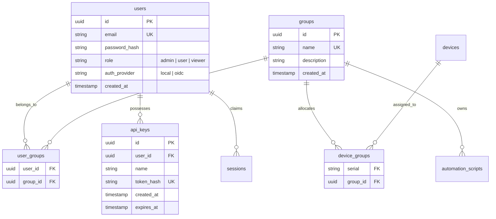

# 15 — Authentication & Authorization (RBAC & Groups) Integration Plan

This document outlines the design and implementation strategy for integrating Authentication and Role-Based Access Control (RBAC) with Group-Based Tenancy into the Protean Provider ecosystem.

---

## 1. Executive Summary & Goals

As Protean Provider matures from a single-tenant local testing tool into a multi-tenant enterprise mobile device cloud, it requires robust security. We must establish:
* **Who** is accessing the system (**Authentication**).
* **What** they can do (**Role-Based Access Control — RBAC**).
* **Which** resources (devices, scripts, reports) they can see/control (**Group-Based Tenancy**).

### Core Goals:
1. **Multi-Type Authentication:** Support Single Sign-On (OIDC/OAuth2), Local Username/Password, and headless API keys for CI/CD integrations.
2. **Group-Wise Device Distribution:** Devices belong to groups, and users can only view, claim, or interact with devices assigned to their corresponding groups.
3. **Shared Automation Scripts:** Scripts belong to groups or are global. Members of a group can view, modify, and execute scripts associated with that group.
4. **Independent Yet Integrable Service:** Design the auth system so it can run as an independent microservice (`protean-auth`) or be compiled directly into the Coordinator control plane for simple deployments.

---

## 2. Authentication Technology Strategy

To satisfy diverse environments (local developer setups, offline private clouds, and corporate enterprise networks), we will support three primary authentication types:

```
                  ┌──────────────────────────────────────────┐
                  │            Client Requests               │
                  └────────────────────┬─────────────────────┘
                                       │
            ┌──────────────────────────┼──────────────────────────┐
            ▼                          ▼                          ▼
 ┌────────────────────┐     ┌────────────────────┐     ┌────────────────────┐
 │  Local Auth (DB)   │     │    SSO / OIDC      │     │  API Keys / CI/CD  │
 │  • Username/Pass   │     │  • Keycloak / Okta │     │  • Headless script │
 │  • Hashing: Bcrypt │     │  • JWT Validation  │     │    executions      │
 │  • Session Cookies │     │  • OAuth2 flow     │     │  • SHA-256 Hashes  │
 └──────────┬─────────┘     └──────────┬─────────┘     └──────────┬─────────┘
            │                          │                          │
            └──────────────────────────┼──────────────────────────┘
                                       ▼
                       ┌──────────────────────────────┐
                       │    Access Token / JWT        │
                       │   Claims: User, Role, Groups │
                       └──────────────────────────────┘
```

### A. OAuth2 / OpenID Connect (OIDC) (Primary Enterprise Auth)
* **How it works:** Users log in via an external Identity Provider (IdP) such as Keycloak, Okta, Active Directory (via Ping/ADFS), Google Workspace, or GitHub.
* **Token Format:** Stateless JSON Web Tokens (JWTs) signed using RSA (RS256).
* **Validation:** The `coordinator` or gateway fetches public keys from the IdP's JWKS (JSON Web Key Set) endpoint and validates JWTs without calling the IdP for every request.
* **Groups mapping:** Group memberships are mapped directly from JWT claims (e.g. `groups` or `roles` claim) to synchronize corporate directories automatically.

### B. Local Authentication (Fallback / Offline Auth)
* **How it works:** A simple username/password system stored in the local PostgreSQL database.
* **Security:** Passwords hashed using **bcrypt** (cost 12) or **Argon2id**.
* **Session Management:** The auth handler issues a system-signed JWT (HMAC-SHA256) valid for a configurable duration (e.g., 24 hours).

### C. API Keys / Service Tokens (CI/CD / CLI Auth)
* **How it works:** High-performance, long-lived, or rotating API tokens generated via the UI for automated runners (e.g. Jenkins, GitLab CI).
* **Format:** Prefixed tokens (e.g., `pt_live_abcdef123456...`).
* **Security:** Tokens are hashed using SHA-256 before storage in the database. When a client requests authentication, we hash the incoming token and compare it with the stored hash to prevent database compromise from exposing keys.

---

## 3. Service Architecture: Independent Service vs. Embedded Module

We propose a **modular microservice architecture** implemented as a separate package (`internal/auth`) and command (`cmd/auth`).

### Trade-Off Analysis

| Criteria | Embedded Module (in Coordinator) | Independent Service (`protean-auth`) | Proposed Hybrid Model |
| :--- | :--- | :--- | :--- |
| **Deployment Complexity** | Low (Single binary to run) | Medium (Additional container/service) | **Low to Medium** (Shared codebase, optional separate binary) |
| **Scaling** | Scaled together | Scaled independently | **Flexible** (Can run inside Coordinator OR standalone) |
| **Latency** | Zero-latency internal checks | Extra HTTP/gRPC hop for token checks | **Zero-latency** (Stateless JWT validation via middleware) |
| **DB Isolation** | Shared DB schemas | Completely isolated Auth DB | **Shared PostgreSQL instance** with strict schema boundaries |

### Proposed Hybrid Architecture
* **The Auth Engine (`internal/auth`):** Built as a Go package that exposes HTTP routes and helper methods for validating JWTs and querying DB states.
* **Standalone Deployment:** A separate binary `protean-auth` can be compiled and deployed if identity management needs to be isolated (e.g. behind an API Gateway).
* **Embedded Deployment (Default):** The `coordinator` mounts the auth router under `/api/v1/auth` directly in its HTTP server. This keeps operations extremely simple for 90% of deployments.
* **Stateless Gatekeeping:** Downstream services (like the REST API and gRPC gateways) validate the signed JWT completely statelessly. They do not query the database to verify a token unless check-revocation lists or token-blacklisting are enabled.

---

## 4. PostgreSQL Database Schema Additions

To support users, groups, permissions, and group-wise device/script ownership, we will apply the following database migrations:



### SQL Schema Definition:
```sql
-- 1. Users Table
CREATE TABLE IF NOT EXISTS users (
    id UUID PRIMARY KEY,
    email TEXT UNIQUE NOT NULL,
    password_hash TEXT, -- NULL for external SSO/OIDC users
    role TEXT NOT NULL DEFAULT 'user', -- 'admin', 'user', 'viewer'
    auth_provider TEXT NOT NULL DEFAULT 'local', -- 'local', 'keycloak', 'google', etc.
    created_at TIMESTAMP NOT NULL DEFAULT NOW(),
    updated_at TIMESTAMP NOT NULL DEFAULT NOW()
);

-- 2. Groups Table
CREATE TABLE IF NOT EXISTS groups (
    id UUID PRIMARY KEY,
    name TEXT UNIQUE NOT NULL,
    description TEXT,
    created_at TIMESTAMP NOT NULL DEFAULT NOW()
);

-- 3. User-Group Mapping (Many-to-Many)
CREATE TABLE IF NOT EXISTS user_groups (
    user_id UUID NOT NULL REFERENCES users(id) ON DELETE CASCADE,
    group_id UUID NOT NULL REFERENCES groups(id) ON DELETE CASCADE,
    PRIMARY KEY (user_id, group_id)
);

-- 4. Device-Group Mapping (Many-to-Many)
CREATE TABLE IF NOT EXISTS device_groups (
    serial TEXT NOT NULL REFERENCES devices(serial) ON DELETE CASCADE,
    group_id UUID NOT NULL REFERENCES groups(id) ON DELETE CASCADE,
    PRIMARY KEY (serial, group_id)
);

-- 5. API Keys / Service Tokens Table
CREATE TABLE IF NOT EXISTS api_keys (
    id UUID PRIMARY KEY,
    user_id UUID NOT NULL REFERENCES users(id) ON DELETE CASCADE,
    name TEXT NOT NULL,
    token_hash TEXT UNIQUE NOT NULL,
    created_at TIMESTAMP NOT NULL DEFAULT NOW(),
    expires_at TIMESTAMP
);

-- 6. Modify Existing Tables to Support Scoping
-- Scoping Automation Scripts to groups (NULL means a global/public script)
ALTER TABLE automation_scripts ADD COLUMN IF NOT EXISTS group_id UUID REFERENCES groups(id) ON DELETE SET NULL;
ALTER TABLE automation_scripts ADD COLUMN IF NOT EXISTS created_by UUID REFERENCES users(id) ON DELETE SET NULL;

-- Scoping Sessions to registered User IDs
ALTER TABLE sessions ADD COLUMN IF NOT EXISTS user_id UUID REFERENCES users(id) ON DELETE SET NULL;
```

---

## 5. RBAC & Group-Based Authorization Rules

Authorization is determined by a combination of a user's **System Role** (what actions they can perform) and their **Group Memberships** (which devices and scripts they can perform those actions on).

### A. Role-Based Permissions Matrix

| Operations | Super Admin (`admin`) | Group Manager (`group_admin`) | Developer/Tester (`user`) | Auditor/Viewer (`viewer`) |
| :--- | :---: | :---: | :---: | :---: |
| **Manage Users & Roles** | Yes | No | No | No |
| **Create/Delete Groups** | Yes | No | No | No |
| **Manage Group Members** | Yes | Yes (their groups only) | No | No |
| **Register Providers** | Yes | No | No | No |
| **Assign Devices to Groups**| Yes | Yes (their groups only) | No | No |
| **Create/Edit Scripts** | Yes | Yes (their groups only) | Yes (their groups only) | No |
| **Claim/Control Devices** | Yes | Yes (their groups only) | Yes (their groups only) | No |
| **View Dashboard / Reports**| Yes | Yes (their groups only) | Yes (their groups only) | Yes (their groups only)|

### B. Group-Wise Access Control Resolution logic

For non-admin users, we restrict data querying and commands at the SQL or API level:

#### 1. Device Visibility & Claiming:
A user `U` can only see, list, claim, or send control commands to device `D` if:
$$\text{IsAdmin}(U) \lor \exists G \left( G \in \text{Groups}(U) \land G \in \text{Groups}(D) \right)$$
* **SQL Query Filter for Listing Devices:**
  ```sql
  SELECT d.* FROM devices d
  INNER JOIN device_groups dg ON d.serial = dg.serial
  INNER JOIN user_groups ug ON dg.group_id = ug.group_id
  WHERE ug.user_id = :current_user_id
  ```
  *(Super admins bypass this filter and view all devices).*

#### 2. Automation Script Visibility & Management:
A user `U` can view, edit, or run automation script `S` if:
$$\text{IsAdmin}(U) \lor S.\text{group\_id} = \text{NULL} \lor S.\text{group\_id} \in \text{Groups}(U)$$
* **SQL Query Filter for Listing Scripts:**
  ```sql
  SELECT * FROM automation_scripts
  WHERE group_id IS NULL 
     OR group_id IN (SELECT group_id FROM user_groups WHERE user_id = :current_user_id)
  ```

#### 3. Automation Reports Visibility:
* Reports are filtered in the same manner. Users can only access execution reports for scripts and devices they have group access to.

---

## 6. Implementation Phases

We will execute this plan sequentially to maintain project stability and prevent breaking changes.

### Phase 1: Database Migration & Core Domain Models
* Create the migrations under `internal/db/db.go`.
* Implement the new domain structs (`User`, `Group`, `ApiKey`) in `internal/domain/`.
* Write CRUD database operations in `internal/db/` to create users, hash passwords, create groups, map devices, and manage API keys.

### Phase 2: Modular Auth Package (`internal/auth`)
* Create `internal/auth/jwt.go` to handle JWT signing, verification, claims parsing, and JWKS fetching for OIDC.
* Create local authenticator controller (`login`, `register` admin, token renewal).
* Implement OIDC flow helper (exchange OAuth code or validate tokens from frontend).
* Write unit tests for local hashing, token generation, and claims validations.

### Phase 3: Gateway Middleware & Context Propagation
* Build an HTTP middleware wrapper (`AuthMiddleware`) in `coordinator_server` that:
  1. Extracts tokens from the `Authorization: Bearer <JWT>` header or session cookies.
  2. Resolves API keys from request headers (e.g. `X-API-Key`).
  3. Validates the claims and populates the request context with user info:
     ```go
     ctx = context.WithValue(ctx, UserContextKey, UserInfo{ID: uid, Email: email, Role: role, Groups: groups})
     ```
* Port gRPC interceptors to propagate user context across gRPC calls between Coordinator and Providers if necessary (using gRPC metadata).

### Phase 4: Scoping and Filtering Integration
* Refactor endpoints in `internal/coordinator_server/http.go`:
  * `handleListDevices`: Apply SQL group matching.
  * `handleDeviceAction` (claim/control/release): Check if user is in device's group.
  * `handleScripts` & `handleScriptByID`: Scopes write/read access.
  * `handleRunScript`: Verifies user belongs to the group governing both the script AND the targeted device serials.
* Implement default seeding: When the server boots up, create a default `Public` group, register an initial `admin@apmosys.com` user, and assign newly discovered devices to the `Public` group by default.

### Phase 5: Frontend Integration & End-to-End Tests
* Update the Angular-based frontend (`frontend/`) to:
  * Add a Login Page (supporting local credentials and OIDC redirect).
  * Intercept HTTP requests to add the `Authorization` header.
  * Adjust dashboard views based on group permissions (e.g., hiding unclaimed/unaccessible devices or admin dashboards).
* Write integration tests simulating multiple users in different groups executing scripts on overlapping and separate device subsets.

---

> [!IMPORTANT]
> **Backward Compatibility Guard:**
> To ensure local testing environments continue working instantly without complex setup, the authorization middleware will have a `bypass_in_development` configuration parameter. When true, if no Authorization header is present, the system defaults to a mock user (`admin@apmosys.com`, role: `admin`, groups: `[Public]`), matching the legacy behavior.

> [!NOTE]
> **Default Seeding Credentials:**
> When the system boots up and finds the `users` table empty, it automatically seeds a default local administrator user:
> - **Email:** `admin@domain.com`
> - **Password:** `Welcome@2026`

